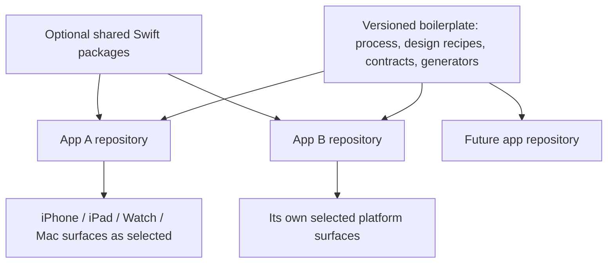

# Architecture for several Apple apps

This boilerplate is the **factory**, not the product. Each app gets its own brief, selected identity, targets, release plan, and support loop. Reuse grows from proven duplication; it is not a reason to force unrelated apps into one bundle or account system.

## Stable and variable boundaries

| Stable across the portfolio | Chosen per app |
| --- | --- |
| Task packets, quality gates, accessibility baseline, privacy review method, troubleshooting format, semantic token names, interaction contract fields. | User problem, promise, app name, icon, personality recipe, navigation, minimum OS, platforms, capabilities, data model, payment model. |

The same word “Save” should mean the same kind of outcome within an app, but the place and presentation of Save may differ by platform. An icon family may share a visual grammar without making every product indistinguishable.

## Share deliberately

1. Start with one app repository and a local package only when a concrete feature benefits from a clean boundary.
2. If two apps truly reuse model or service code, extract a small versioned Swift package with an owner, tests, compatibility range, and release notes. Keep brand assets and app-specific UX out of generic packages.
3. Share user data only when the user benefit and privacy model are explicit. Same-device sharing may use App Groups; cross-device sharing may use iCloud. Those are distinct mechanisms with entitlements and migration obligations.
4. Expose cross-app actions with platform-supported mechanisms only when it improves a real journey. Document which app owns the data and what happens when a companion app is absent.
5. Maintain an SDK and OS compatibility matrix. For a future Apple device, add a platform profile, check APIs and input, then build a native shell and verify it. Do not promise future hardware support in advance.

## Portfolio controls

- Assign each app a unique bundle identity, store presence, support path, privacy declaration, and release history.
- Version this boilerplate. Generated apps record the template version; upgrades should be reviewed as migrations, not copied wholesale over product decisions.
- Keep secrets, signing credentials, and App Store roles outside generated templates. Grant agents only the access their task requires.
- Make the shared identity system semantic: brand choices map to meaning, appearance variants, and accessibility. Let each product select Playful/Kinetic, Calm/Precise, or Dark/Technical and extend it.
- Do not make a shared backend, subscription, login, analytics SDK, or cross-promotion mandatory. Add one when its value and operating cost are clear.

Apple references reviewed 2026-09-25: [local Swift packages](https://developer.apple.com/documentation/xcode/organizing-your-code-with-local-packages), [configuring App Groups](https://developer.apple.com/documentation/xcode/configuring-app-groups), [shared data](https://developer.apple.com/documentation/technologyoverviews/shared-data), [App Intents](https://developer.apple.com/documentation/appintents/appintent), [Mac distribution options](https://developer.apple.com/documentation/xcode/distributing-your-app-for-beta-testing-and-releases).
