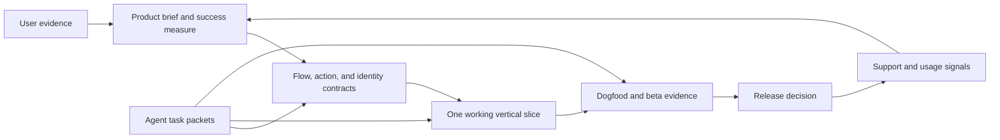

# Solo builder and agent operating system

The leverage is a small, coherent product with short feedback loops. Treat each agent as a specialist working from a bounded task packet. The human builder owns product judgment, customer contact, access to accounts, and release decisions. Share durable artifacts, not vague conversation history.

## Architecture of the work

In a real app repository, keep the product model and action semantics shared where useful. Put platform navigation and input in platform-specific shells. Add adapters for selected system features such as StoreKit, WidgetKit, ActivityKit, App Intents, and CloudKit. Create a local Swift package only when code is genuinely reusable; an empty layer adds coordination cost.

## Phase gates

| Phase | Decide and make | Exit evidence | Primary owner |
| --- | --- | --- | --- |
| 0. Workspace | Repo, source control, task board, decision log, toolchain, access boundaries. | Clean reproducible checkout and a known Xcode/SDK version. | Builder |
| 1. Discovery | Observe a repeated problem, current workaround, competitors, and Apple baseline. | Notes from real people; one narrow job to solve. | Builder + research agent |
| 2. Value | First-session result, return trigger, business model hypothesis, non-goals. | Product brief and a measurable success criterion. | Builder |
| 3. Experience | Flows, action contracts, empty/error/permission states, input and accessibility paths. | Walkable prototype or storyboard with no unexplained dead end. | Design agent + builder |
| 4. Identity | Select per-app recipe, semantic tokens, copy voice, icon brief and concepts. | Reviewed small-size icon concept and UI state samples. | Design agent |
| 5. Technical design | Primary platform, minimum OS, targets/extensions, data ownership, privacy, security, entitlements. | Architecture record and capability matrix tied to the product job. | Engineering agent + builder |
| 6. Vertical slice | Build one complete task with real data or a faithful local fixture. | Runs on primary device; success, failure, and recovery demonstrated. | Engineering agent |
| 7. System surfaces | Add only useful widgets, Live Activities, Watch, Mac, shortcuts, notifications, or background work. | Each surface has a distinct user purpose and device proof. | Platform agent |
| 8. Quality | Unit tests for rules, UI tests for critical journeys, previews, native experience review, accessibility, localization, performance, battery, privacy review. | Recorded native review and test matrix with resolved release blockers. | QA agent + builder |
| 9. Beta | Sign, archive, distribute, collect TestFlight feedback, inspect crashes and confusion. | Representative testers complete the job; triaged feedback. | Builder |
| 10. Store | App record, screenshots, listing, privacy details, ratings, pricing and IAP if relevant, reviewer access. | Release candidate and completed submission checklist. | Builder |
| 11. Operate | Support, crash and performance review, retention and payment evidence, OS compatibility. | Prioritized fixes and a measured next iteration. | Builder + agents |

These gates are evidence prompts, not a demand for a large process. A one-person project can keep each artifact to a page. Do not advance by filling templates with guesses.

## Team functions for one person plus agents

| Function | Best delegated work | Human decision |
| --- | --- | --- |
| Research | Collect current primary sources, competitor behavior, user interview synthesis. | Which problem deserves the next month. |
| Product design | Explore flows, copy, identity options, icon concepts, accessible states. | Which experience feels valuable and coherent. |
| Platform engineering | Investigate API availability, build isolated modules, diagnose simulator and device behavior. | Which capabilities belong in the product. |
| Quality | Generate edge cases, automate repeatable checks, reproduce failures, compare screenshots. | Whether the remaining risk is acceptable. |
| Release operations | Prepare metadata drafts, check required fields, monitor build and review status. | Account actions, pricing, submission, and public claims. |

Give each task a packet using `docs/agents/TASK-PACKET.md`: **user outcome; source of truth; exact write scope; shared-file coordination; constraints; downstream consumers; acceptance evidence; expected output; stop condition.** For UI tasks, include Liquid Glass and representative-device performance checks. Ask an agent to report changed files, test results, observed limitations, and decisions requiring the builder. Keep code tasks small enough to review in one sitting. Do not let an agent declare a device test, entitlement, or App Review result from a document alone.

## Dogfood loop

Once an app exists, keep a local dataset with first launch, normal, empty, large, offline, permission-denied, expired, and conflict states that actually apply. Make those states quick to open in previews or a debug menu. Record a short screen capture of the first useful result, the slowest path, and the main failure path. Track confusing moments and support requests in `docs/operations/WORKBOARD.md`; fix the repeated friction before adding more surfaces.

## Release and economic loop

Measure the behavior tied to the product's job: first useful result, repeated use, task completion, failure and recovery, retention, and paid conversion if applicable. Record the definition and source of each metric before collecting it. Use minimal data, respect user choices, and keep analytics optional until there is a question worth answering. A subscription requires ongoing value and working purchase/restore behavior; pricing benchmarks are hypotheses until this app has its own data.

## Control surface

- **Fixed by Apple or the user:** platform rules, API availability, review decisions, user trust, real-world demand.
- **Controlled by the team:** scope, quality, interaction and visual design, data policy, architecture, reliability, support, positioning, and pricing within applicable rules.
- **Observed outcomes:** task success, repeat use, performance, crashes, support load, conversion, refunds, reviews, and revenue. The team can influence these through changes and experiments, but cannot set them directly.

Apple sources reviewed 2026-09-25: [Human Interface Guidelines](https://developer.apple.com/design/human-interface-guidelines/), [Xcode targets](https://developer.apple.com/documentation/xcode/configuring-a-new-target-in-your-project/), [local packages](https://developer.apple.com/documentation/xcode/organizing-your-code-with-local-packages), [Xcode Cloud workflows](https://developer.apple.com/documentation/xcode/configuring-your-first-xcode-cloud-workflow), [TestFlight overview](https://developer.apple.com/help/app-store-connect/test-a-beta-version/testflight-overview/), [App Store Connect workflow](https://developer.apple.com/help/app-store-connect/get-started/app-store-connect-workflow).
