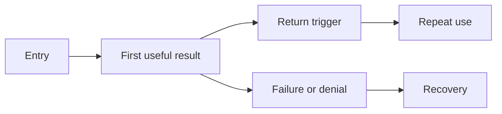

# Experience flows

Map the entry point, first result, repeat use, errors, permissions, purchase if selected, and recovery. Draw the user's path before choosing screens.

Replace this neutral flow with the product's actual actions and decision points.
