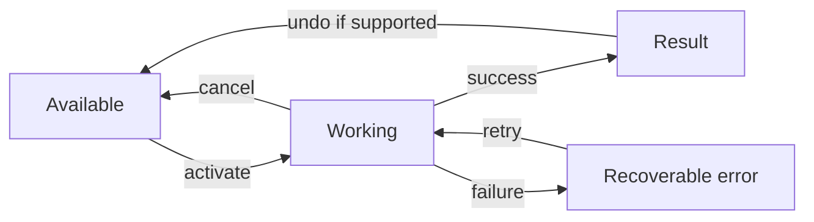

# Action contract template

Copy this for each important product action. Keep the meaning independent of its screen or device.

| Field | Decision |
| --- | --- |
| User intent and expected result | Pending |
| Action name and visible label | Pending |
| Entry points by platform | Pending |
| Requirements and permission state | Pending |
| Immediate feedback | Pending |
| Running, success, empty, and failure states | Pending |
| Can repeat? Can cancel? Can undo? | Pending |
| Destructive or private-data implications | Pending |
| Keyboard, pointer, remote, voice, and accessibility equivalents | Pending |
| Event or metric worth recording | Pending |

## State path

Specify what the person sees at each transition. A disabled control needs an understandable reason or a visible route to meet its prerequisite. A destructive action needs a deliberate label and a recovery policy.
