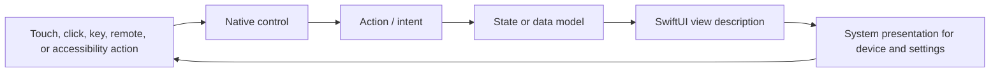

# How an interaction becomes pixels

In a SwiftUI app, you describe a view from current state. A native control receives an input, runs its action, and the resulting state change causes SwiftUI to update affected views. You usually do not draw each pressed or hover frame yourself.

## Choose where state lives

- Keep transient view state near the view that owns it, such as a selected tab, open sheet, or in-progress indicator.
- Keep shared app data in a model with one clear source of truth. Pass read-only values or bindings as appropriate.
- Persist durable user data separately; a view's local state is not durable storage.
- Represent async operations with explicit ready, working, success, and failure states so every input path gets the same feedback.

`Button` provides normal activation behavior. A `ButtonStyle` can change its appearance while retaining standard behavior. A custom primitive style or gesture recognizer changes more of the interaction contract and needs broader testing. Platform controls will adapt appearance, focus, and input behavior, so preview on each selected destination.

Apple references: [Managing user interface state](https://developer.apple.com/documentation/swiftui/managing-user-interface-state/), [Managing model data](https://developer.apple.com/documentation/swiftui/managing-model-data-in-your-app/), [ButtonStyle](https://developer.apple.com/documentation/swiftui/buttonstyle). Reviewed 2026-09-25.
